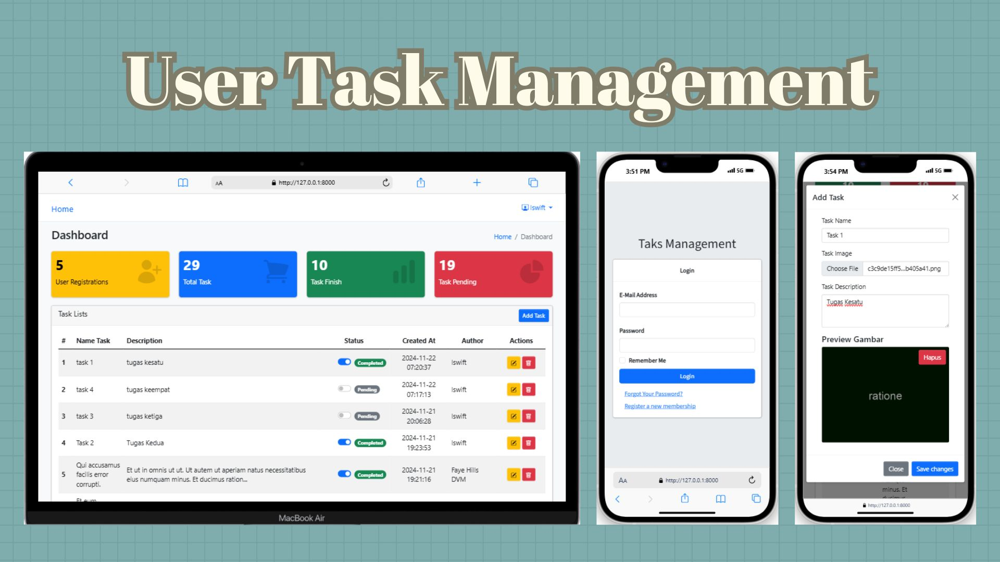

# User Task Management

[![Latest Version on Packagist][ico-version]][link-packagist]
[![Total Downloads][ico-downloads]][link-downloads]




Sebuah aplikasi Manajemen Tugas User berbasis web menggunakan Laravel, memungkinkan pengguna untuk menambah, memperbarui, dan menghapus tugas dengan fitur upload gambar dengan fitur authentikasi menggunakan Fortify.

## Fitur

- Autentikasi (Login, Logout, Registrasi, Reset Password, Verify Email).
- CRUD Task (Create, Read, Update, Delete).
- Upload gambar pada setiap tugas.
- Update status task (Pending/Completed).

## Persyartan Sistem

Sebelum menjalankan proyek, pastikan anda sudah menginstall:

- [PHP](https://www.php.net)
- [Composer](https://getcomposer.org)
- [Database](https://www.mysql.com)
- [Git](https://git-scm.com)
- [Laravel](https://laravel.com)
- [Mailtrap](https://mailtrap.io)

## Installasi

1. Clone Repository
    Gunakan perintah berikut di terminal favorit anda:
    ``` bash
    git clone https:/github.com/apriyes204/task-management.git
    cd task-management
    ``` 
   
3. Install Dependencies
    Jalankan perintah berikut:
    ``` bash
    composer install
    ``` 
   
5. Setup Environment
   
   - Copy `.env` dari `.env.example` dengan perintah berikut:
    ``` bash
    cp. .env.example .env
    ```

   - Buat kunci baru di projek anda
    ``` bash
    php artisan key:generate
    ``` 

   - Tambahkan direktori untuk laravel mengakses file
    ``` bash
    php artisan storage:link
    ```

   - Buka file `.env` kemudian ubah beberapa konfigurasi berikut:
     ``` bash
        DB_CONNECTION= {Sesuaikan dengan type database anda, MYSQL/PGSQL}
        DB_PORT= {Gunakan port sesuai database server anda, 3306 adalah port standar}
        DB_USERNAME= {Sesuaikan dengan database server anda, root adalah username standar}
        DB_HOST= {Sesuaikan dengan hostname database server anda, 127.0.0.1 jika anda menggunakan database lokal}
        DB_DATABASE= {Sesuaikan dengan database server anda}
        DB_PASSWORD= {Sesuaikan dengan database server anda, biasanya kosong jika anda menggunakan pengaturan database default}
     ```

    - Silahkan anda buat akun mailtrap untuk konfigurasi email berikut:
        ``` bash
          MAIL_MAILER=smtp
          MAIL_HOST=smtp.mailtrap.io
          MAIL_PORT=2525
          MAIL_USERNAME=your_mailtrap_username
          MAIL_PASSWORD=your_mailtrap_password
          MAIL_ENCRYPTION=null
          MAIL_FROM_ADDRESS=your_email@example.com
          MAIL_FROM_NAME="${APP_NAME}"
        ```

7. Migrasikan database anda dengan perintah berikut di terminal:
   ```bash
   php artisan migrate --seed
   ```

8. Jalankan project di server lokal dengan perintah berikut di terminal:
    ``` bash
    php artisan serve
    ```

## Credits

Proyek ini dikembangkan oleh [Achmad Dwi Apriyanto](https://github.com/apriyes204).  
Terima kasih kepada komunitas Laravel, pustaka open-source, dan semua pihak yang berkontribusi dalam pengembangan proyek ini.

## License

Proyek ini dilisensikan di bawah [MIT License](license.md).  
Silakan gunakan, modifikasi, atau distribusikan proyek ini dengan tetap mematuhi ketentuan lisensi.

## Catatan

Saya sangat berterima kasih atas apresiasi dan dukungan anda untuk memberikan bintang pada repositori ini.


[ico-version]: https://img.shields.io/packagist/v/charlieuki/receiptprinter.svg?style=flat-square
[ico-downloads]: https://img.shields.io/packagist/dt/charlieuki/receiptprinter.svg?style=flat-square
[ico-travis]: https://img.shields.io/travis/charlieuki/receiptprinter/master.svg?style=flat-square
[ico-styleci]: https://styleci.io/repos/12345678/shield

[link-packagist]: https://packagist.org/packages/charlieuki/receiptprinter
[link-downloads]: https://packagist.org/packages/charlieuki/receiptprinter
[link-travis]: https://travis-ci.org/charlieuki/receiptprinter
[link-styleci]: https://styleci.io/repos/12345678
[link-author]: https://github.com/charlieuki
[link-contributors]: ../../contributors
